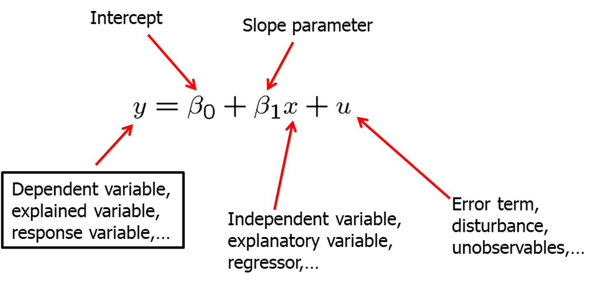
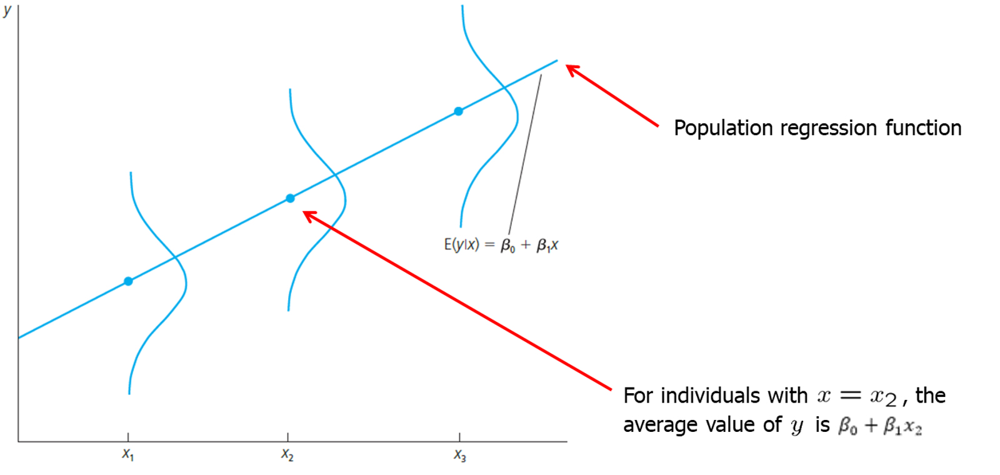
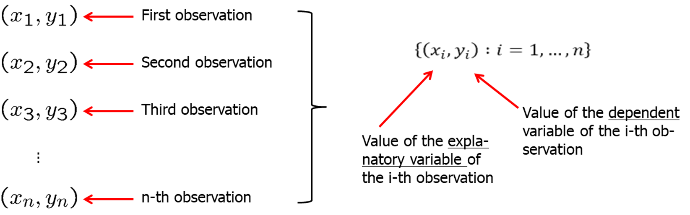
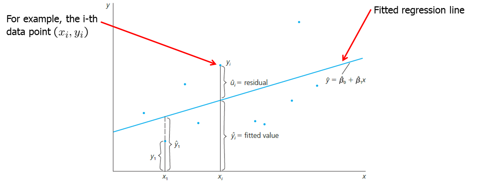

```{r setup, include=FALSE}
options(htmltools.dir.version = FALSE) 
knitr::opts_chunk$set(echo = FALSE, warning = FALSE, message = FALSE, fig.width = 8, fig.height = 6)
library(tidyverse)
library(gghighlight)
library(jtools)

```


``` {r xaringan-themer, include=FALSE, warning=FALSE}
# install.packages("remotes")
#remotes::install_github('rstudio/chromote')
#remotes::install_github("jhelvy/xaringanBuilder")
library (wooldridge) # need to load the package before using it
library(fixest) # needed to run the regression feols
library(modelsummary)
library(xaringanBuilder)
library(xaringanthemer)
style_duo_accent(
 # primary_color = "#1381B0",
  primary_color = "#006600", # color first slide and titles
  secondary_color = "#FF961C",
  inverse_header_color = "#FFFFFF"  #white
)

#this to build PDF :)
#build_pdf('https://github.com/andrahiriscau/Econometrics_Slides/blob/main/Lecture_1/Econometrics.html')
#build_pdf('https://andrahiriscau.github.io/Econometrics_Slides/Chapter_2/Chapter_2.html')

```


---
## 2.1 Definition of the Simple Regression Model

.red[“Explains variable y in terms of variable x”]
--
```{r}

```

---
### The Simple Regression Model

 

By how much does the dependent variable change if the independent variable is increased by one unit?
$$\frac{\Delta y}{\Delta x}=\beta_{1} \quad$$


Interpretation only correct if all other  things remain equal when the independent variable is increased by one unit.

 $$\quad \frac{\Delta u}{\Delta x}=0$$

???
add notes
---
### The Simple Regression Model
  - Example: Soybean yield and fertilizer

```{r}


```

  - Example: A simple wage equation 

```{r}


```

Does $\beta_{1}$ measure a CAUSAL effect of $x$ on $y$?


  - It depends on the relationship with $x$ and $u$ 


---
### The Simple Regression Model

Assumption 1: $E(u)=0$ 

As long as $\beta_{0}$ is included in the regression, nothing is lost assuming that the average value of  $u$ in the population is zero. Why?

 - When is there a causal interpretation?
 
Assumption 2:  $E(u|x)=E(u)$
 
   - The independent variable does not contain information about the mean of the unobserved factors 
   - Average values of the unobservables is the same across all values of $x$, and that the common average is equal to the average of $u$ over the entire population
 

---
### The Simple Regression Model

**Zero Conditional Mean Assumption:** $E(u|x)=0$


Intuition:

```{r}


```


---
### Population regression function (PFR)

- The zero conditional mean independence assumption ($ E(u|x)=0 $) implies that:

$$
\begin{aligned}
E(y \mid x) &=E\left(\beta_{0}+\beta_{1} x+u \mid x\right) \\
&=\beta_{0}+\beta_{1} x+E(u \mid x) \\
&=\beta_{0}+\beta_{1} x
\end{aligned}
$$

- It means that the average value of the dependent variable can be expressed as a linear function of the explanatory variable. This is the +unknown+ population function.

- $E(y \mid x)$ tells us how the average value if $y$ changes with $x$; it does not say that $y$ equals $\beta_{0}+\beta_{1} x$ for all units in the population
 
  - Example $E(colGPA|hsGPA)=1.5+ 0.5hsGPA$

- Note: One unit increase in $x$ changes the *expected values* of  $y$ by the amount of $\beta_{1}$

---
### Population regression function (PFR)

```{r}


```

---
### Causation VS Correlation

What is correlation?

- Correlation is a statistical measure that expresses the extent to which two variables are linearly related (meaning they change together at a constant rate).
- [Spurious correlations LINK](https://www.tylervigen.com/spurious-correlations) 

Correlation **DOES NOT IMPLY** causation !!!

- [Ceteris Paribus VIDEO](https://mru.org/courses/mastering-econometrics/ceteris-paribus)

- The required assumption to establish causality is the zero conditional mean independence ($E(u|x)=0$)


---

## 2.2 Deriving the Ordinary Least Square (OLS) Estimates

- In order to estimate the regression model one needs data

- A random sample of $n$ observations

```{r}


```

---
### Deriving the Ordinary Least Square (OLS) Estimates

The Ordinary Least Squares method estimates the intercept and slope of a line that “best fits” the observed data by minimizing the sum of the squared distances between the points and the line.

```{r}


```


[**Guess the regression line- SIMULATION**](https://professoramanda.github.io/econsimulations/)

---
### Deriving the Ordinary Least Square (OLS) Estimates (Math)

Let's derive OLS estimates mathematically.

- Define regression **residuals**:

$$\widehat{u}_{i}=y_{i}-\widehat{y}_{i}=y_{i}-\widehat{\beta}_{0}-\widehat{\beta}_{1} x_{i}$$

- Minimize the sum of the squared regression residuals 

$$\min \sum_{i=1}^{n} \widehat{u}_{i}^{2} \rightarrow \widehat{\beta}_{0}, \widehat{\beta}_{1}$$

- OLS estimators

$$\widehat{\beta}_{1}=\frac{\sum_{i=1}^{n}\left(x_{i}-\bar{x}\right)\left(y_{i}-\bar{y}\right)}{\sum_{i=1}^{n}\left(x_{i}-\bar{x}\right)^{2}}$$


$$\quad \widehat{\beta}_{0}=\bar{y}-\widehat{\beta}_{1} \bar{x}$$


---
### Deriving the Ordinary Least Square (OLS) Estimates in R

[Install *wooldridge* package to have access to the data sets-link](https://github.com/JustinMShea/wooldridge)

[Introductory Econometrics Examples-link](https://justinmshea.github.io/wooldridge/articles/Introductory-Econometrics-Examples.html)

Example 2.4 Wage and Education
```{r, echo=TRUE,eval=FALSE}
#install.packages("wooldridge")
library (wooldridge) # need to load the package before using it
library(fixest) # needed to run the regression feols
library(modelsummary)

data ("wage1") # load the data
?wage1 #check out the documentation in the Help panel
# we could use lm package, but feols is useful for future chapters
model<- feols(wage~educ, data=wage1) 
#summary(model)
modelsummary(model)

```
---
Example 2.4 Wage and Education
```{r, echo=FALSE,eval=TRUE}
#install.packages("wooldridge")
library (wooldridge) # need to load the package before using it
library(fixest) # needed to run the regression feols
library(modelsummary)
library(broom)
library(dplyr)
library(knitr)
library(kableExtra)
library(readr)
library(tidyr)
data ("wage1") # load the data
?wage1 #check out the documentation in the Help panel
# we could use lm package, but feols is useful for future chapters
model<-feols(wage~educ, data=wage1)

#summary(model)
modelsummary(model, output = "markdown")
#kableExtra::kable(x = broom::tidy(model), format = "pipe")
#kable(wage1)
```

---
```{r, echo=TRUE}
library(DT)
DT::datatable(head(wage1, 10),
  fillContainer = FALSE, options = list(pageLength = 5))

```

---
## 2.3 Properties of OLS on Any Sample of Data

Fitted (or predicted) values: $\hat{y}_i=\hat{\beta}_0+\hat{\beta}_0x_i$

Residuals: $\hat{u}_i=y_i+\hat{y_i} $

Algebraic properties:

  -  Deviation from the regression (residuals) line sum up to zero 

$$\sum_{i=1}^{n} \widehat{u}_{i}=0$$ 

  -  Covariance between residuals and independent variables is zero 
  
$$\quad \sum_{i=1}^{n} x_{i} \widehat{u}_{i}=0$$

   -  Sample averages of $y$ and $x$ lie on the regression line
    
$$\quad \bar{y}=\widehat{\beta}_{0}+\widehat{\beta}_{1} \bar{x}$$

---
### CEO data

This table presents the predicted values and residuals for 15 CEOs

  - What is the predicted salary for the $12^{th}$ CEO?
  - Is it higher or lower than their actual salary?
  
  - What is the predicted salary for the $5^{th}$ CEO?
  - Is it higher or lower than their actual salary?
  

---
### Goodness of fit

How well does an independent variable explain the dependent variable?

Total sum of squares (SST)- represents the total variation in the dependent variable

$$S S T \equiv \sum_{i=1}^{n}\left(y_{i}-\bar{y}\right)^{2} \quad S S E \equiv$$

Explained sum of squares (SSE)- represents variation explained by regression

$$\sum_{i=1}^{n}\left(\hat{y}_{i}-\bar{y}\right)^{2} $$
Residual sum of squares (SSR)- represents variation **NOT** explained by regression

$$\quad S S R \equiv \sum_{i=1}^{n} \hat{u}_{i}{ }^{2}$$


---
### Goodness of fit

Decomposition of total variation:

Total variation= Explained part + Unexplained part

$$SST= SSE + SSR$$

Goodness-of-fit measure (R-squared)

  - R-squared measure the fraction of the total variation that is explained by the regression


$$R^{2} \equiv \frac{S S E}{S S T}=1-\frac{S S R}{S S T}$$


---
### Goodness-of-fit measure (R-squared)

```{r}
data ("ceosal1") # load the data
data ("vote1") # load the data


models <- list(
  "salary_hat"  = salary_hat<-feols(salary~roe, data=ceosal1),
  "vote_hat" = vote_hat<-feols(voteA~shareA, data=vote1))


modelsummary(models)
```

How do we interpret $R^2$?

???
The regression explains only 1.3% of the total variatiob in salaries

The regression explains 85.6% of the total variatiob in election outcomes


---
## 2.4 Units of measurement and functional form

  - Level- level regression:
$y=\beta_{0}+\beta_{1} x+\epsilon$

  - Log- level regression:  
$\ln (y)=\beta_{0}+\beta_{1} x+\epsilon$

  - Level- log regression:
$y=\beta_{0}+\beta_{1}ln(x)+\epsilon$

  - Log- level regression:
$\ln (y)=\beta_{0}+\beta_{1} ln(x)+\epsilon$


---
### Level- level regression:
$y=\beta_{0}+\beta_{1} x+\epsilon$


---
### Log- level regression: 
$$\ln (y)=\beta_{0}+\beta_{1} x+\epsilon$$


---
### Level- log regression
$y=\beta_{0}+\beta_{1}ln(x)+\epsilon$

---
### Log-Log- level regression
$\ln (y)=\beta_{0}+\beta_{1} ln(x)+\epsilon$


---
## 2.5 Standard Assumptions for the Linear Regression Model

- Assumption SLR 1: **Linear in parameters**

- Assumption SLR.2 **Random sampling**

- Assumption SLR.3 **Sample variation in the explanatory variable**

- Assumption SLR.4 **Zero conditional mean**

