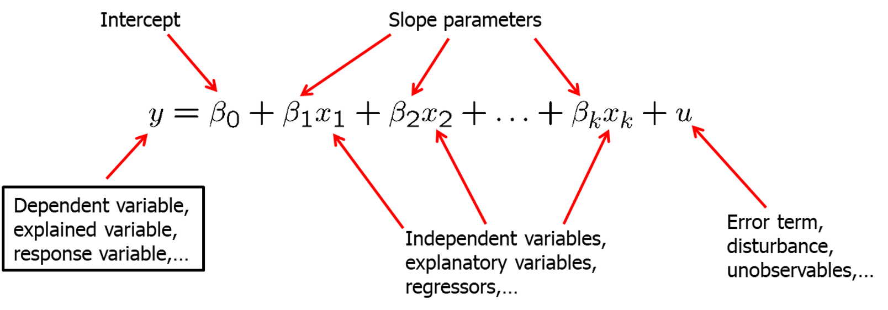
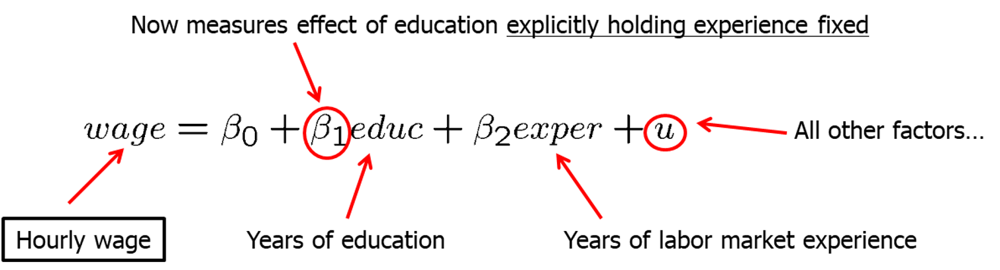
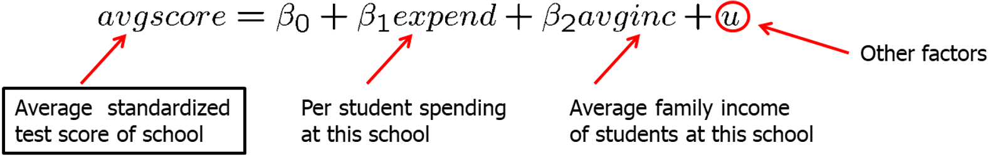
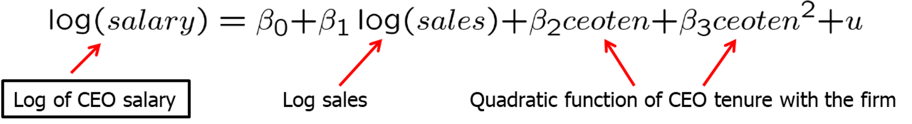

```{r setup, include=FALSE}
options(htmltools.dir.version = FALSE) 
knitr::opts_chunk$set(echo = FALSE, warning = FALSE, message = FALSE, fig.width = 8, fig.height = 6)
library(tidyverse)
library(gghighlight)
library(jtools)
library (wooldridge) # need to load the package before using it
library(fixest) # needed to run the regression feols
library(modelsummary)

```


``` {r xaringan-themer, include=FALSE, warning=FALSE}
# install.packages("remotes")
#remotes::install_github('rstudio/chromote')
#remotes::install_github("jhelvy/xaringanBuilder")

library(xaringanBuilder)
library(xaringanthemer)
style_duo_accent(
 # primary_color = "#1381B0",
  primary_color = "#006600", # color first slide and titles
  secondary_color = "#FF961C",
  inverse_header_color = "#FFFFFF"  #white
)

#this to build PDF :)
#build_pdf('https://github.com/andrahiriscau/Econometrics_Slides/blob/main/Lecture_1/Econometrics.html')
#build_pdf('https://andrahiriscau.github.io/Econometrics_Slides/Chapter_2/Chapter_2.html')


build_pdf(input = "Elasticity.Rmd",
          output_file = "slides_complex_partial.pdf",
          complex_slides = TRUE,
          partial_slides = TRUE)
```


---
## 3.1 Definition of the multiple linear regression model


"Explains variable $y$ in terms of variables $x_{1}, x_{2}, \ldots, x_{k}$ "

```{r, out.width="600px", fig.align = 'center'}

```

--

Why use multiple regression model?

--
<ol>
  <li>  Incorporate more explanatory factors into the model
--
  <li>  Explicitly hold fixed other factors that otherwise would be in the error term
--
  <li> Allow for more flexible functional forms
  </ol>


---

### Examples

 - Wage equation
 
```{r, out.width="500px", fig.align = 'center'}

```

--

  - Average test scores and per student spending
  
```{r, out.width="500px", fig.align = 'center'}

```

   - Per student spending is likely to be correlated with average family income at a given high school because of school financing.
    
   - Omitting average family income in regression would lead to biased estimate of the effect of spending on average test scores.

   - In a simple regression model, effect of per student spending would partly include the effect of family income on test scores.

---

### Examples

  - Family income and family consumption
      - Model has two explanatory variables: income and income squared


```{r, out.width="500px", fig.align = 'center'}

```

By how much does consumption increase if income is increased by one unit?

--

$$\frac{\Delta \operatorname{con} s}{\Delta \operatorname{inc}} \approx \beta_{1}+2 \beta_{2} \operatorname{inc}$$

Depends on how much income is already there

--

   - CEO salary, sales and CEO tenure
   
```{r, out.width="500px", fig.align = 'center'}

```

--

Note: Meaning of “linear” regression- the model has to be linear in the parameters (not in the variables)

   


???
Consumption is explained as a quadratic function of income

Model assumes a constant elasticity relationship between CEO salary and the sales of his or her firm.
Model assumes a quadratic relationship between CEO salary and his or her tenure with the firm.


---

## 3.2 Mechanics and Interpretation of Ordinary Least Squares

 ### a) Obtaining the OLS estimates
 
 - Random sample
 
$$\left\{\left(x_{i 1}, x_{i 2}, \ldots, x_{i k}, y_{i}\right): i=1, \ldots, n\right\}$$

- Regression residuals
$$\widehat{u}_{i}=y_{i}-\widehat{\beta}_{0}-\widehat{\beta}_{1} x_{i 1}-\widehat{\beta}_{2} x_{i 2}-\ldots-\widehat{\beta}_{k} x_{i k}$$
- Minimize sum of squared residuals
$$\min \sum_{i=1}^{n} \widehat{u}_{i}^{2} \rightarrow \widehat{\beta}_{0}, \widehat{\beta}_{1}, \widehat{\beta}_{2}, \ldots, \widehat{\beta}_{k}$$

???
The method of OLS chooses the estimates to minimize the sum of squared residuals

---

 ### b) Interpreting the OLS Regression Equation
 
$$\widehat{y}=\widehat{\beta_{0}}+\widehat{\beta_{1}} x_{1}+\widehat{\beta_{2}} x_{2}+\ldots+\widehat{\beta_{k}} x_{k}$$

By how much does the dependent variable change if the k-th independent variable is increased by one unit, holding all other independent variables constant?

--

$\beta_{k}=\frac{\Delta y}{\Delta x_{k}}$

  - "Ceterius paribus" holding all other independent variables constant
  
  - The multiple linear regression model manages to hold the values of other explanatory variables fixed even if they are correlated with the explanatory variable under consideration.
  
  - It has still to be assumed that unobserved factors do not change if the explanatory variables are changed.

  
---

Example: 3.1 Determinants of college GPA

```{r,echo=TRUE,eval=TRUE}
data(gpa1, package='wooldridge')

GPAres<-feols(colGPA~ hsGPA+ACT, data = gpa1)
GPAsingle<-feols(colGPA~ hsGPA, data = gpa1)

models <- list(GPAres, GPAsingle)

modelsummary(models,output = "markdown")

```
  ???
  Interpretation example 3.1
  Interpretation
Holding ACT fixed, another point on high school grade point average is associated with another .453 points college grade point average
Or: If we compare two students with the same ACT, but the hsGPA of student A is one point higher, we predict student A to have a colGPA that is .453 higher than that of student B
Holding high school grade point average fixed, another 10 points on ACT are associated with less than one point on college GPA

  
---
  
  Example: 3.2 Hourly wage equation
  
```{r,echo=TRUE,eval=TRUE}
data(wage1, package='wooldridge')

summary(feols(lwage~educ+exper+tenure, data = wage1))
```

???
example 3.2 interpretation


---

### c) The Meaning of "Holding Other Factors Fixed" in Multiple Regression


- In example 3.1, we observed that the coefficient on `ACT` measures the predicted difference in `colGPA`, holding `hsGPA` fixed

--

- It may seem that we sampled people with the same `hsGPA` but different `ACT` scores

--

- **Data is random** , no restrictions were placed on the values of `hsGPA` and `ACT`

--

- If we could collect a sample of individuals with the same HSGPA, then we could preform a simple regression `ColGPA` and `ACT`

--

- Multiple regression allows us to mimic this situation without restricting the values of any independent variables


---


### d) Changing More than One Independent Variable Simultaneously


  $$\widehat{\Delta \log (\text { wage })}=.0041{\Delta exper}+ 0.22{\Delta tenure} $$
  
  What is the effect on `wage` if `exper` and `tenure` both increase by *one year*?
  
  --
  
  The total effect  (holding `educ` fixed) is: 
  
  $$\widehat{\Delta \log (\text { wage })}=.0041{\Delta exper}+ 0.22{\Delta tenure}==.0041+.022=.0261$$
    
 Because `exper` and `tenure` each increase by one year, we just add the coefficients on  `exper` and `tenure` and multiply by 100 to tun the effect into percentage (about 2.6 %).
 
 
 ---
 
 ### e) OLS Fitted Values and Residuals
 
 
 
    

  
  
  
  
  


%r plot-right, fig.show = 'hide'}
{r ref.label = 'plot-right', echo = FALSE}