```{r setup, include=FALSE}
options(htmltools.dir.version = FALSE) 
knitr::opts_chunk$set(echo = FALSE, warning = FALSE, message = FALSE, fig.width = 8, fig.height = 6)
library(tidyverse)
library(gghighlight)
library(jtools)


```


``` {r xaringan-themer, include=FALSE, warning=FALSE}
# install.packages("remotes")
#remotes::install_github('rstudio/chromote')
#remotes::install_github("jhelvy/xaringanBuilder")
library (wooldridge) # need to load the package before using it
library(fixest) # needed to run the regression feols
library(modelsummary)
library(xaringanBuilder)
library(xaringanthemer)
style_duo_accent(
 # primary_color = "#1381B0",
  primary_color = "#006600", # color first slide and titles
  secondary_color = "#FF961C",
  inverse_header_color = "#FFFFFF"  #white
)

#this to build PDF :)
#build_pdf('https://github.com/andrahiriscau/Econometrics_Slides/blob/main/Lecture_1/Econometrics.html')
#build_pdf('https://andrahiriscau.github.io/Econometrics_Slides/Chapter_2/Chapter_2.html')


```

## Content

 Review

 Introduction

1. **The Price Elasticity of Demand and Its Measurement**
      + *Learning Objective*: Define and calculate price elasticity of demand
      
2. **The Determinants of the Price Elasticity of Demand**
      + *Learning Objective*: List and explain the determinants of the price elasticity of demand

3. **The Relationship Between Price Elasticity of Demand and Total Revenue**
      + *Learning Objective*: Explain the relationship between the price elasticity of demand and total revenue

4. **Other Demand Elasticities**
      + *Learning Objective*: Define and calculate the cross-price elasticity of demand and the income elasticity of demand and explain their determinants.


---
## Review

**Law of demand**

When price goes up quantity demanded ...... ?

**Revenue** 

Revenue is the total amount of income generated by the sale of goods and services:

$$Revenue=P \times Q$$


---
## Introduction

```{r, out.width="400px", fig.align = 'center'}

```

Recently a number of cities have enacted taxes on soda and other sweetened beverages. Why?

--

 - To reduce sugar consumption, and hence obesity and diabetes
 
--

 - To raise funds (tax revenues) for public projects

--

$$Revenue=P \times Q$$
--

$$Tax~ revenues=Tax \times Q$$

???
The tax revenue a city raises equals the tax per ounce of soda multiplies by the number of ounces of soda sold.


--

Example:
 
$$Tax~ revenues=1.5~ (cents) \times 6 ~(billions)=90 ~million~ dollars$$

???
eg: if the tax is 1.5 cents per ounce, and 6 billion of soda sold, the tax will raise $90 mil

Interestingly, these goals partially conflict: The tax raises the prices consumers pay for sodas, the quantity demanded decreases. The greater the decline in the quantity of sodas, the greater the health effect of the tax...but the less revenue the city will raise form the tax.

All soda producers (and supermarkets) have a financial incentive to determine how much their sales will change as they increase or decrease price.

Government also have an incentive to determine how consumers will react if the price of product rises due to to a tax increase.
 
--

How can we know what the actual outcome will be?

--

  -  **Elasticity**- *which allows us to measure the responsiveness of the quantity demanded or the quantity supplied to changes in the market price*

???
In this chapter, we will explore the important concept of elasticity, which allows us to measure the responsiveness of the quantity demanded and the quantity supplies to changes in the market price


---

## 1. The Price Elasticity of Demand and Its Measurement

### Learning Objective: Define and calculate price elasticity of demand

As the price of sweetened beverages increase, we expect people will buy fewer of them. But how many fewer?


```{r, out.width="400px", fig.align = 'center'}
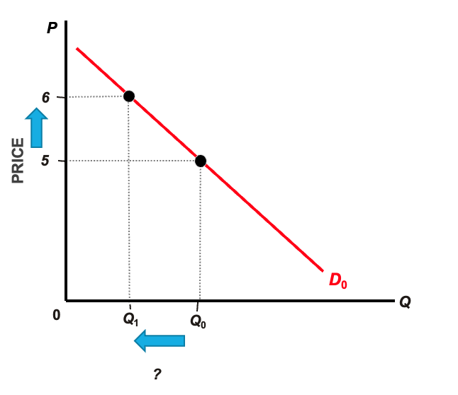
```

--

How can we come up with a sensible way to measure how much quantity changes when price changes?

--

  - One idea is to look at the slope of the demand curve which tells us how much quantity changes as price changes
  
--
 
  - Drawback: The measurement of slope is sensitive to the units chosen for quantity and price (e.g. if we measure the price in cents rather than dollar the value of the slope changes dramatically)


---

### Define elasticity


To avoid this confusion, economists define an:
    + **elasticity** a measure of how much one economic variable response to changes in another economic variable, based on **percentage changes** in the variables. 

    + percentage changes are not dependent on units of measurement.


Review: The percentage change is the change in some economics variable, usually from one period to the next, expressed as a percentage.
 
 

$$Percentage ~change=\left(\frac{\text { Value in the second period }-\text { Value in the first period }}{\text { Value in the first period }}\right) \times 100$$

**Elasticity** measures the responsiveness of one variable to changes in another.


$$E_{xy}=\frac{\% \Delta X}{\% \Delta Y}$$


---
### Price Elasticity of demand

```{r, out.width="200px", fig.align = 'center'}
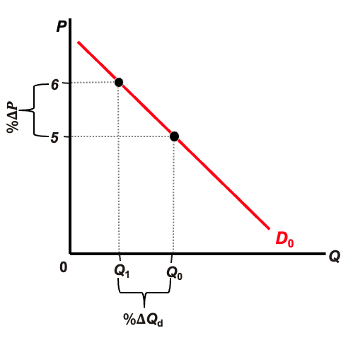
```


$$E_{d}=\frac{\% \Delta Q_{d}}{\% \Delta P}$$
  - $\Delta$ is the Greek letter delta. In the above equations it means "change in".
  
  - The numerator is read"The percentage change in quantity demanded".
  
  - The denominator is read "The percentage change in price".


???
For example, a 10 percent decrease in the price of bagels results in 20% increase in quantity of bagels demanded: 20%/-10%=-2

Price elasticity of demand is not the same as the slope of the demand curve

---

### French fries news (Example)

```{r, out.width="500px", fig.align = 'center'}

```


“Fried food is one of Americans’ oldest obsessions. The pandemic took that to a deeper level. More people are ordering french fries with their fast food, and seeking solace in fried chicken, say food industry executives and nutritionists.”

Executives from Lamb Weston Holdings Inc. , a key supplier of french fries to fast-food chains said “recently that even rising prices aren’t lessening consumers’ appetites for their fries”

*“What’s the elasticity of a french fry?”* says Tom Werner, Lamb Weston’s CEO. 
“Right now, we haven’t seen it.”
```{r, out.width="250px", fig.align = 'right'}

```

---

### French fries (Question)	

Assume that the price of french fries rises by:
    + $10 \%$,( $\% \Delta P=\%10$)
    + and the quantity demanded for French fries falls by $1 \%, (\% \Delta Q_{d}=-\%1)$

What would we expect the of price elasticity of demand to be in the case of french fries?

```{r, out.width="300px", fig.align = 'center'}

```


--

Price Elasticity of demand:
$$E_{d}=\frac{\% \Delta Q_{d}}{\% \Delta P}=\frac{-1}{10}=-.1$$
Plugging in $\% \Delta Q_{d}=-1$ and $\% \Delta P=10$


---
### Elastic Demand and Inelastic Demand


Price Elasticity of demand:
$$E_{d}=\frac{\% \Delta Q_{d}}{\% \Delta P}$$

```{r, out.width="600px", fig.align = 'center'}
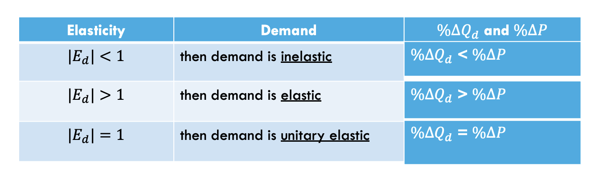
```

???
-3 is a smaller number than -2, we say that price elasticity of -3 is larger than a price elasticity of -2. We often drop the minus sign and compare their absolute values.

P and Q are negatively correlated, price elasticity is always negative-- refer to absolute value

---

### An example of calculating price elasticities

```{r, out.width="600px", fig.align = 'center'}
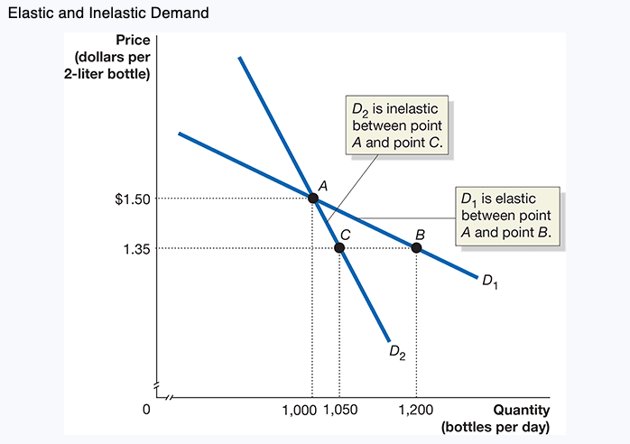
```


---

### The Midpoint Formula


Price elasticity of demand $=\frac{\left(Q_{2}-Q_{1}\right)}{\left(\frac{Q_{1}+Q_{2}}{2}\right)} \div \frac{\left(P_{2}-P_{1}\right)}{\left(\frac{P_{1}+P_{2}}{2}\right)}$

  - This first term is the percentage change in quantity

  - The second term is the percentage change in price
  
```{r, out.width="600px", fig.align = 'center'}
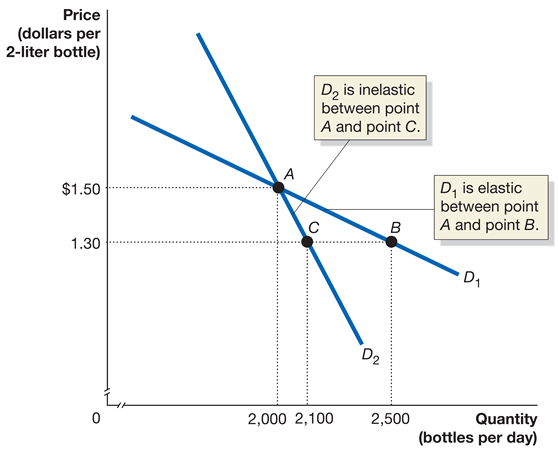
```

Price elasticity of demand $=\frac{22.2 \%}{-14.3 \%}=-1.6$


---

### Perfectly Inelastic Demand Curve

A vertical demand curve means that quantity demanded does not change as price changes.
  - So elasticity is zero.
  - A vertical demand curve is perfectly inelastic.

```{r, out.width="500px", fig.align = 'center'}
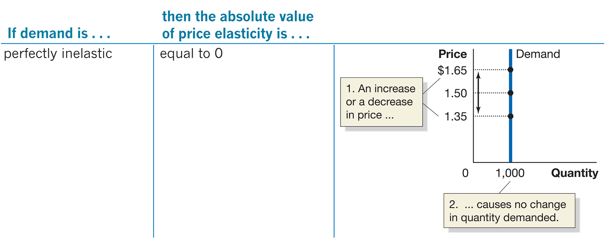
```

**Perfectly inelastic demand**: The case where the quantity demanded is completely unresponsive to price and the price elasticity of demand equals zero.

---
### Perfectly Elastic Demand Curve

A horizontal demand curve means quantity demanded is infinitely responsive to price changes.
  - Elasticity is infinite.
  - A horizontal demand curve is perfectly elastic.

```{r, out.width="500px", fig.align = 'center'}
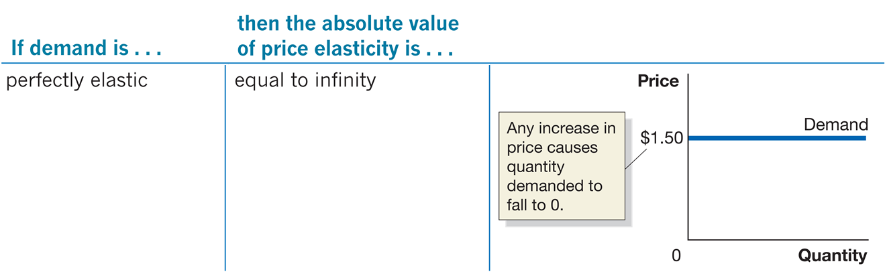
```

**Perfectly elastic demand**: The case where the quantity demanded is infinitely responsive to price and the price elasticity of demand equals infinity.

--

Another special case occurs when a decrease in price results in the same percentage increase in quantity demanded; in this case we say demand is unit elastic.


---

## 2 The Determinants of the Price Elasticity of Demand

### Objective: List and explain the determinants of the price elasticity of demand.

<ol>
  <li>  The availability of close substitutes
</ol>  

  - If a product has more substitutes available, it will have more elastic demand.
  - Example: There are few substitutes for gasoline, so its price elasticity of demand is low.
  - Example: There are many substitutes for Nikes (Reeboks, Adidas, etc.), so their price elasticity of demand is high.

<ol start="2">
<li>  The passage of time
</ol> 

  - Over time, people can adjust their buying habits more easily. Elasticity is higher in the long run than the short run.
  - Example: If the price of gasoline rises, it takes a while for people to adjust their gasoline consumption. How might they do that?
    - Buying a more fuel-efficient car
    - Moving closer to work

---
### Determinants of the price elasticity of demand

<ol start="3">
<li>  Whether the good is a luxury or a necessity
</ol> 

  - People are more flexible with luxuries than necessities, so price elasticity of demand is higher for luxuries.
  - Example: Many people consider milk and bread necessities; they will buy them every week almost regardless of the price.


<ol start="4">
<li>  The definition of the market
</ol> 

  - The more narrowly defined the market, the more substitutes are available, and hence the more elastic is demand.
  - Example: You might believe there is no good substitute for jeans, so your demand for jeans is very inelastic.
  - But if you consider different brands of jeans, you might be more sensitive to the price of a particular brand.


---
### Determinants of the price elasticity of demand

<ol start="5">
<li> The share of a good in a consumer’s budget
</ol> 

  - If a good is a small portion of your budget, you will likely not be very sensitive to its price.
  - Example: You might buy table salt once a year or less; changes in its price will not affect very much how much you buy.

--

**Estimated Real-World Price Elasticities of Demand**

```{r, out.width="500px", fig.align = 'center'}
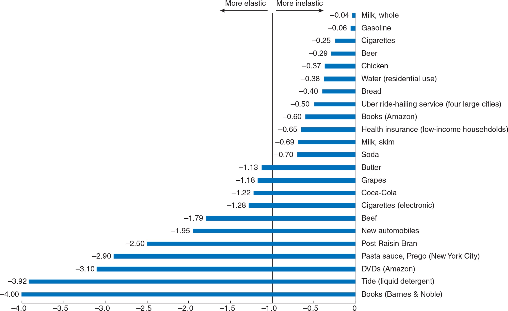
```

---

## 3. The Relationship Between Price Elasticity of Demand and Total Revenue
### Learning Objectives: Explain the relationship between the price elasticity of demand and total revenue.

If you are a business owner, you need to decide how to price your product.
“How many customers will I gain if I cut my price?”
“What will happen to my total revenue if I cut my price?”


Knowing the price elasticity of demand for your product can help to answer these questions.
Total revenue: The total amount of funds a seller receives from selling a good or service, calculated by multiplying price per unit by the number of units sold.


---
### Effect of Cutting Price with Different Elasticities

*Suppose demand for your product is relatively price inelastic:*

  - Customers are not very sensitive to the price of your product.
  - As you decrease the price, you expect to gain few additional customers.
  - The few additional customers do not compensate for the lost revenue, so overall revenue goes down.

--

*Suppose demand for your product is relatively price elastic:*

  - Customers are very sensitive to the price of your product.
  - As you decrease the price, you expect to gain many additional customers.
  - The many additional customers more than compensate for the lost revenue, so overall revenue goes up.


---
### Effect of Cutting Price with Different Elasticities


```{r, out.width="500px", fig.align = 'center'}
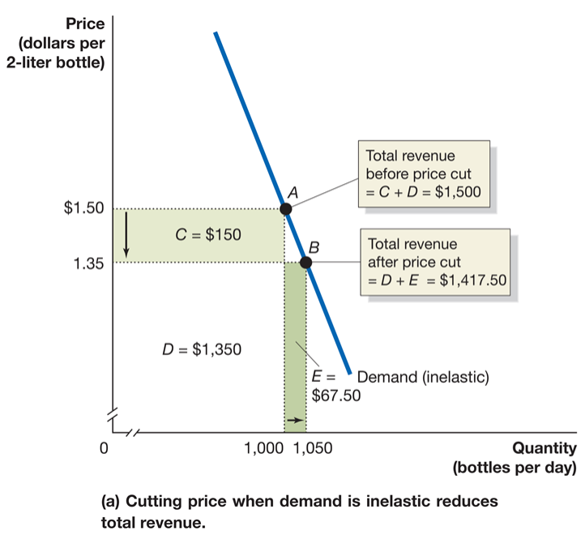
```

Revenue before price cut (at $A$) :

$$1,000 \times \$ 1.50=\$ 1,500$$

Revenue after price cut (at $B$) :

$$1,050 \times \$ 1.35=\$ 1,417.50$$

The decrease in price **does not** generate enough extra customers (area E) to offset revenue loss (area C).


---
### Effect of Cutting Price with Different Elasticities


```{r, out.width="500px", fig.align = 'center'}
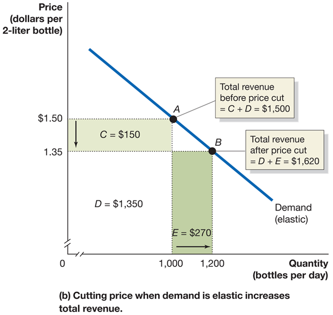
```

Revenue before price cut (at $A$):

$$1,000 \times \$ 1.50=\$ 1,500$$

Revenue after price cut (at $B$):

$$1,200 \times \$ 1.35=\$ 1,620$$

The decrease in price **does** generates enough extra customers (area E) to more than offset revenue loss (area C).


---
### The Relationship Between Price Elasticity and Revenue


```{r, out.width="600px", fig.align = 'center'}

```


---
### Why Are Elasticity and Total Revenue Related?

The formula for price elasticity of demand is :

Price elasticity of demand $=\frac{\text { Percentage change in quantity demanded }}{\text { Percentage change in price }}$

So if this is greater than 1 (in absolute terms) then quantity demanded goes up by a higher percentage than price, raising the revenue.

A special case occurs when price elasticity of demand is −1: the percentage change in quantity demanded equals the percentage change in price so revenue does not change.


---
### Elasticity Is Not Constant Along a Linear Demand Curve 

```{r, out.width="600px", fig.align = 'center'}

```

Suppose we have a linear demand curve.

What happens to total revenue as price increases?

  - Initially, total revenue rises, suggesting demand is inelastic.
  - But then total revenue starts to fall, suggesting demand is elastic!


---
### Elasticity Is Not Constant Along a Linear Demand Curve 

```{r, out.width="600px", fig.align = 'center'}
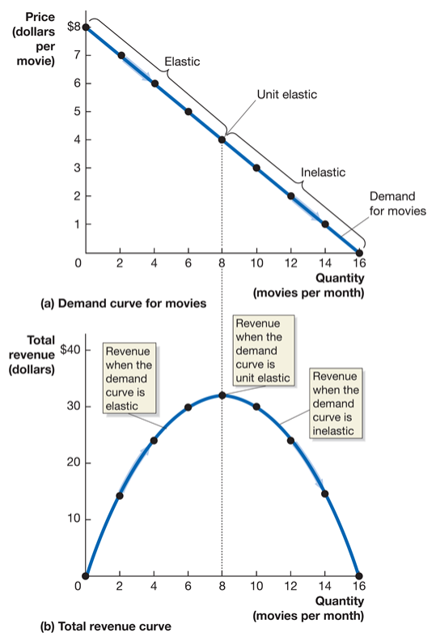
```

The data from the table are plotted in the graphs.

As price decreases from $8, revenue rises—hence demand is elastic.

As price continues to fall, revenue eventually flattens out—demand is unit elastic.

Then as price falls even further, revenue begins to fall—demand is inelastic.


---
### Apply the Concept: Amazon and Netflix Test the Price Elasticity of Demand for Their Services 

```{r, out.width="300px", fig.align = 'left'}

```

In its early years, Amazon kept the price of Amazon Prime low.
What do you think it have believed about the price elasticity of demand for Amazon Prime?

Recently Amazon has raised the price of Amazon Prime (from $79 to $99 in 2014, and to $119 in 2018).
What does this suggest about how Amazon believed the price elasticity of demand had changed?


Do you think the same pattern of elasticity changes has happened with Netflix?
Netflix has raised the price of its two-device plan from $8.99 to $12.99 from 2015-2019. This is consistent with it believing demand has been price inelastic recently.


With more (substitute) streaming options, do you think Netflix will be able to continue raising its price without losing customers?


---
## 6.4 Other Demand Elasticities
### Learning Objective: Define and calculate the cross-price elasticity of demand and the income elasticity of demand and explain their determinants.

Review:

  - Substitutes: Goods and services that can be used for the same purpose.
  
  - Complements: Goods and services that are used together.


--
 **Cross-price elasticity of demand**

Cross-price elasticity of demand is the percentage change in the quantity demanded of one good divided by the percentage change in the price of another good.
 
It measures the **strength** of substitute or complement relationships between goods.

```{r, out.width="300px", fig.align = 'left'}

```


---
### Other Demand Elasticities

Review: 

  - Normal goods: Goods and services for which the quantity demanded increases as income increases
  
  - Inferior goods: Goods and services for which the quantity demanded falls as income increases

--

**Income elasticity of demand**

Income elasticity of demand is a measure of the responsiveness of the quantity demanded to changes in income, measured by the percentage change in the quantity demanded divided by the percentage change in income.


---


\large{Thank You}


